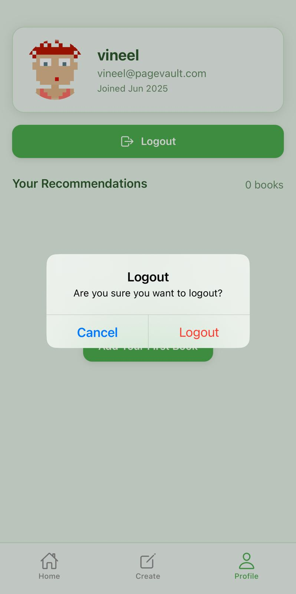
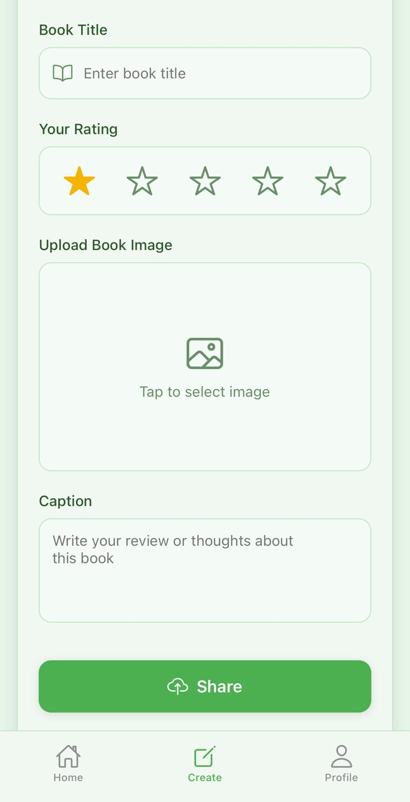

# 📚 PAGEVault

### A cross-platform social networking app designed for sharing and managing book recommendations — secure, fast, and visually dynamic.

---

## 🧾 About the Project

**PAGEVault** is a full-stack book recommendation application built with modern web and mobile technologies. Designed to run seamlessly on iOS, Android, and browsers, it enables users to create, share, and manage their favorite books in a personalized and interactive environment.

This project prioritizes clean architecture, reusability, and responsiveness, with a fully secured backend (Node.js, Express, MongoDB) and real-time image uploads via **Cloudinary**. Deployment is handled via **Render**, ensuring cost-effective and scalable hosting for APIs.

Whether you're reading at home or on the go, PAGEVault offers a platform to connect with book lovers around the globe, all without being limited by device or OS requirements.

---

## 🌟 Key Features

- **Complete Authentication** – Secure signup, login, and logout flow using JWT.
- **Cross-Platform Compatibility** – Works smoothly on iOS, Android, and modern web browsers.
- **Five Core Screens** – Auth, Home, Create, Profile, and additional utility screens.
- **Infinite Loading** – Paginated data fetching for optimized performance.
- **Interactive Book Management** – Users can create, view, and delete book recommendations.
- **Media Upload** – Upload and display book cover images with **Cloudinary**.
- **Profile Section** – View your books, posts, and user details in a clean layout.
- **Theming Support** – Four distinct UI themes for personalized user experience.
- **Smart Alerts** – User-friendly confirmation prompts for critical actions.
- **Custom Branding** – Branded splash screen and logo integration.
- **Mac-Free Development** – Entire project can be developed from any internet-connected machine.
- **Backend API** – Built with **Node.js**, **Express**, and **MongoDB**.
- **Free Hosting** – Backend hosted on **Render** with zero-cost deployment.

---

<h3>Screenshots</h3>

<table>
  <tr>
    <td></td>
    <td></td>
    <td></td>
  </tr>
  <tr>
    <td></td>
    <td></td>
    <td></td>
  </tr>
  <tr>
    <td></td>
    <td></td>
  </tr>
</table>
